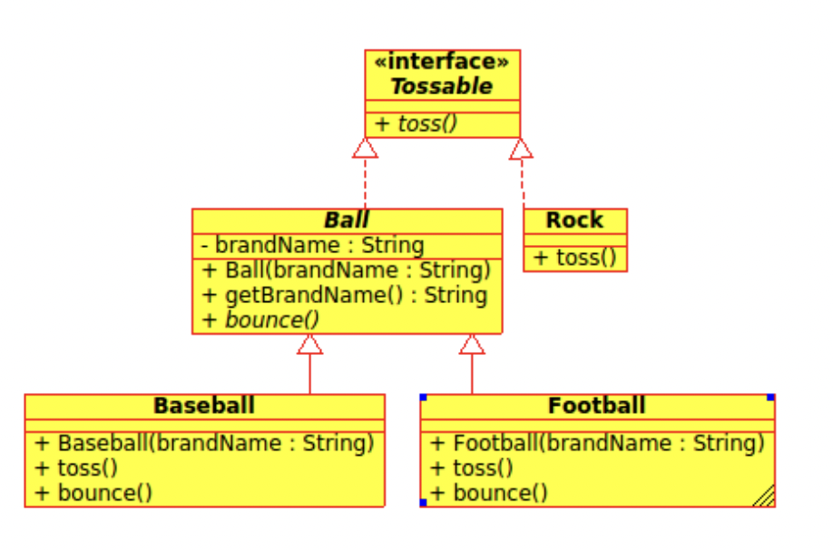
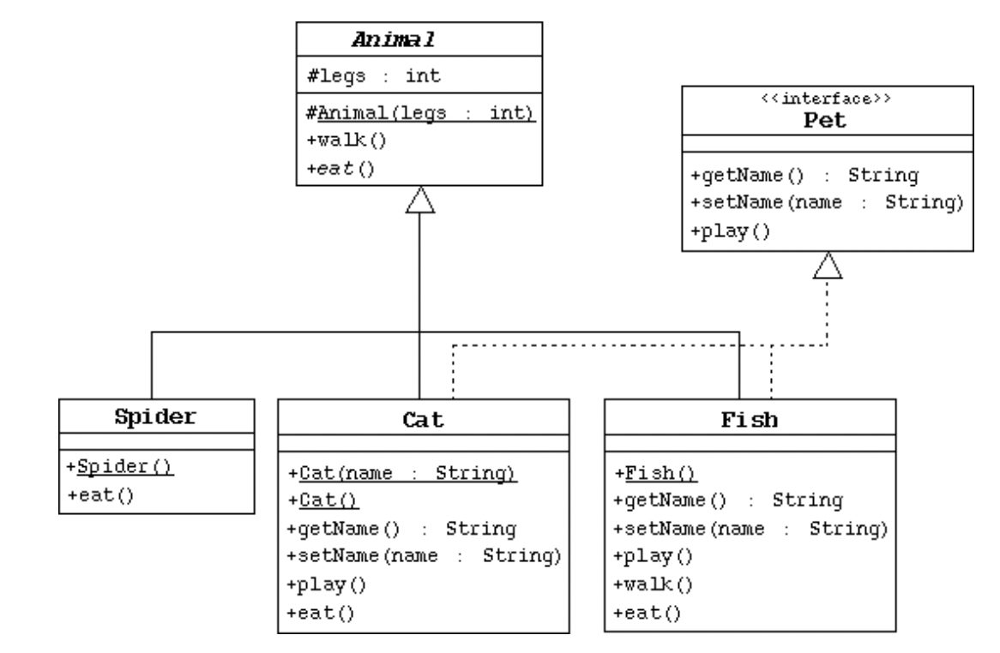

# Programming 2 - Lab 11

This template repository is the starter project for Programming 2 Lab 11. Written in Java, and tested with Gradle/JUnit.

### Question(s)

1. Implement the following classes along with their driver class based on the UML class diagrams:

2. Implement the following classes along with their driver class based on the UML class diagrams. Note that the underline does not mean the methods are static.

1. Create the Animal class, which is the abstract superclass of all animals.
   1.1. Declare a protected integer attribute called legs, which records the number of legs for this animal.
   1.2. Define a protected constructor that initializes the legs attribute.
   1.3. Declare an abstract method eat.
   1.4. Declare a concrete method walk that prints out something about how the animals walk (include the number of legs).

2. Create the Spider class.
   2.1. The Spider class extends the Animal class.
   2.2. Define a default constructor that calls the superclass constructor to specify that all spiders have eight legs.
   2.3. Implement the eat method.
3. Create the Pet interface specified by the UML diagram.
4. Create the Cat class that extends Animal and implements Pet.
   4.1. This class must include a String attribute to store the name of the pet.
   4.2. Define a constructor that takes one String parameter that specifies the cat's name. This constructor must also call the superclass constructor to specify that all cats have four legs.
   4.3. Define another constructor that takes no parameters. Have this constructor call the previous constructor (using the this keyword) and pass an empty string as the argument.
   4.4. Implement the Pet interface methods.
   4.5. Implement the eat method.
5. Create the Fish class. Override the Animal methods to specify that fish can't walk and don't have legs.
