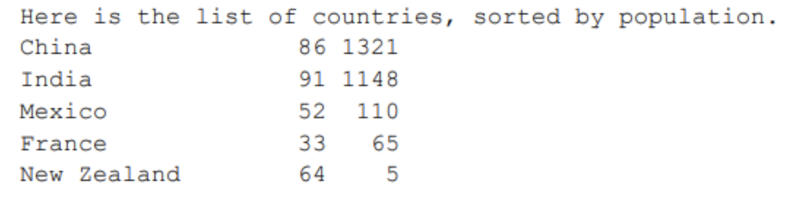
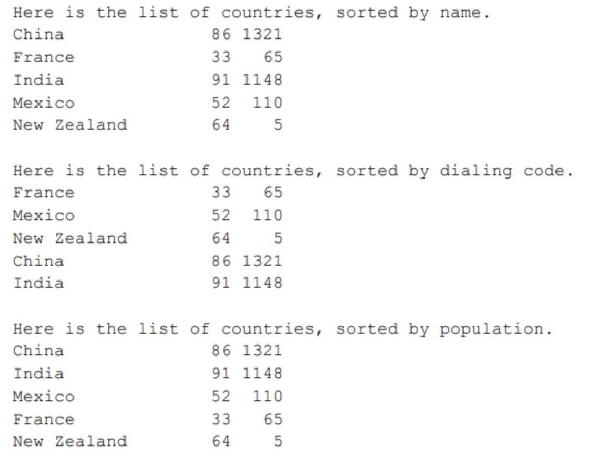

# Programming 2 - Lab 13

This template repository is the starter project for Programming 2 Lab 13. Written in Java, and tested with Gradle/JUnit.

### Question(s)

1. Start by building a Country class, with attributes name, code, and population, and then turn to implement the Comparable interface for this class. The idea is that you should be able to compare two countries by their population and then sort a collection of countries in order relative to their population. Build driver class to test the Country and in the main method build an array list of 5 Countries with different populations. Here is a sample output:

2. For the same class, create three comparator classes. NameComparator, PopulationComparator and CodeComparator. After you implement your comparators, it is time to use them. In your main program, you would call the built-in sort function. It accepts two parameters: the array list to sort, and the comparator. Here is a sample output of the comparator implementations:

3. Override the hashCode() method and generate a hash based on the data members.
