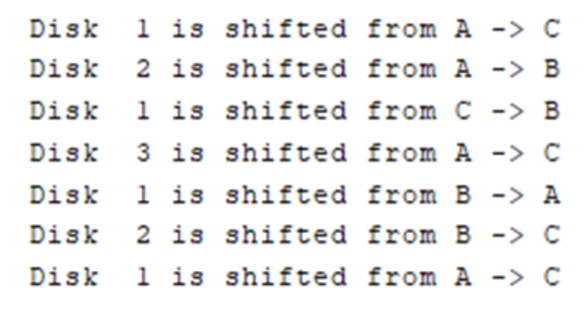
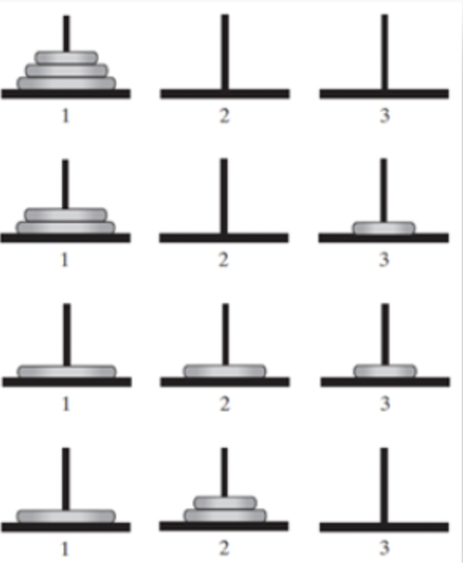
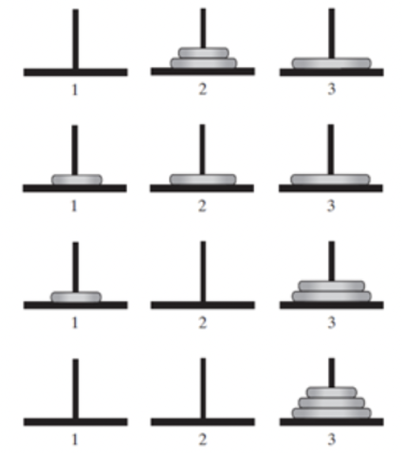

# Programming 2 - Lab 15

This template repository is the starter project for Programming 2 Lab 15.Written in Java, Use JUnit for testing.

### Question(s)

**Some problems are not meant to be done recursively. We are simply examining them recursively for practice in order to help us understand recursion.**

1. Assume that you have an ArrayList of Integer objects. Consider the following code that presents a function that sums the integers in the ArrayList:

```java
static int sum (ArrayList<Integer> anArrayList) {
    	int sum = 0;

    	for (Integer x : anArrayList) {
        	sum += x;
    	}

    	return sum;
}
```

What about doing it recursively? How do you define the problem recursively?

2. (Hard) The Towers of Hanoi is one of the classic problems every budding computer scientist must grapple with. The task is to move the disks from peg A to peg B using peg C as an intermediary (if necessary). Develop a recursive method that prints the precise sequence of peg-to-peg disk transfers. The rules are as follows:

   a. Move one disk at a time. Each disk moved must be the topmost disk.  
   b. A larger disk may never be placed on top of a smaller one.  
   c. You can store disks on the second pole temporarily, as long as you observe the previous two rules.  
   d. When a disk is moved, it must be placed on one of the three pegs.

Here’s the expected output when #disks = 3







