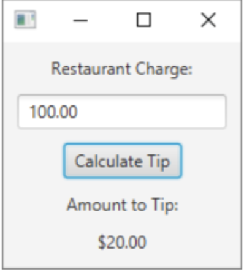

# Programming 2 - Lab 19

This template repository is the starter project for Programming 2 Lab 19. Written in Java, and tested with Gradle/JUnit.

### Question(s)

1. Retail Price Calculator

Create a GUI application where the user enters the wholesale cost of an item and its markup percentage into text fields. (For example, if an item’s wholesale cost is $5 and its markup percentage is 100 percent, then its retail price is $10.) The application should have a button that displays the item’s retail price when clicked.

2. Monthly Sales Tax

A retail company must file a monthly sales tax report listing the total sales for the month, and the amount of federal and provincial sales tax collected. The federal sales tax rate is 5 percent, and the provincial sales tax rate is 10 percent. Create a GUI application that allows the user to enter the total sales for the month into a text field. The application should calculate and display the following:

• The amount of federal sales tax
• The amount of provincial sales tax  
• The total sales tax (county plus state)

3. Tip calculator

Create a tip calculator application. The application will let you enter the amount of a restaurant charge, and it will display the amount of a 20% tip. The completed user interface will look like this:

In your code, you will create the following controls:

• Various Label controls to display text  
• A TextField control to read the user's input  
• A Button control to calculate and display the tip
